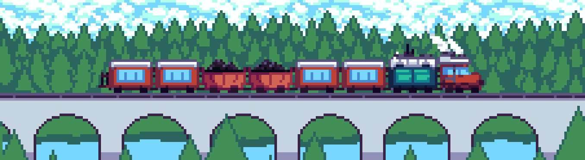

## Using

[<picture><source media="(prefers-color-scheme: light)" srcset="https://api.iconify.design/simple-icons:github.svg?color=%23000000" /></picture>](https://github.com "Github")

## Used

  

  

[<picture><source media="(prefers-color-scheme: light)" srcset="https://api.iconify.design/bi:unity.svg?color=%23000000" /></picture>](https://unity.com "Unity")

## To Learn or Learning

 

### My best projects 👇

